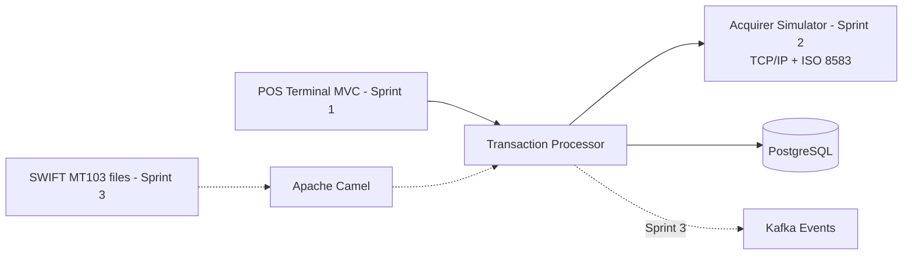

# Financial Integration Platform

A portfolio project that simulates payment processing from a point-of-sale terminal to an acquirer. It is built to demonstrate modern Java, Spring Boot, financial integrations, software quality, and delivery practices.

## Current Implementation

- Java 21 and Spring Boot
- Hexagonal transaction service with domain, application ports, and adapters
- Spring MVC REST API, PostgreSQL/JPA, Lombok, and MapStruct
- React and TypeScript POS terminal for transaction creation and lookup
- JUnit 5, Mockito, and Testcontainers test foundations
- Docker Compose configuration for local PostgreSQL

## Planned Platform

The platform will evolve through four weekly sprints:

1. POS terminal MVC and transaction processing foundations
2. Acquirer simulator using TCP/IP and simplified ISO 8583 messages
3. Kafka, RabbitMQ, Apache Camel, and SWIFT MT103 import flows
4. CI/CD, Sonar quality gates, integration testing, and portfolio documentation

The detailed backlog and demo outcomes are available in the [delivery roadmap](docs/roadmap.md).

## Architecture Direction



## Local Development

1. Copy `.env.example` to `.env` and adjust local-only values when needed.
2. Start Docker Desktop.
3. Run the transaction service from `services/transaction-service` with `./mvnw spring-boot:run`.

The default `local` profile starts the PostgreSQL service defined in `docker-compose.yml` automatically and leaves it running after the application stops. Stop that database from the repository root with `docker compose stop`.

Run the POS terminal separately from `apps/pos-terminal` with `pnpm dev`. It is available at `http://localhost:5173` and proxies `/api` requests to the transaction service on port `8080`.

In IntelliJ, set the working directory of `TransactionServiceApplication` to `services/transaction-service`. The root `.env` file configures Docker Compose; it is not imported into the Java process automatically. The default credentials are for local development only.

Exceptionally, when PostgreSQL is already managed elsewhere, disable automatic Compose startup with `--spring.docker.compose.enabled=false` and provide `DB_URL`, `DB_USERNAME`, and `DB_PASSWORD` as environment variables.

## Configuration Profiles

- `local` is the default profile and connects to the PostgreSQL instance started by Docker Compose.
- `test` is used by Testcontainers and validates the schema created by Flyway migrations.
- `prod` requires database credentials through `DB_URL`, `DB_USERNAME`, and `DB_PASSWORD` and validates, rather than changes, the schema.

Database changes are versioned in `services/transaction-service/src/main/resources/db/migration` and applied by Flyway.

## API Documentation

When the transaction service is running locally, Swagger UI is available at `http://localhost:8080/swagger-ui/index.html`. The generated OpenAPI specification is available at `http://localhost:8080/v3/api-docs`. Both endpoints are disabled in the `prod` profile.

The generated OpenAPI document is the source of truth for API consumers such as `app-terminal`. Its stable Sprint 1 operations are `createTransaction` and `getTransaction`; incompatible request or response changes require a new API contract version.

## Quality Checks

Run unit and web-layer tests without Docker:

```bash
cd services/transaction-service
./mvnw test
```

Run PostgreSQL integration tests when Docker is available:

```bash
./mvnw verify -Pintegration
```

The integration profile verifies persistence adapters and the HTTP transaction flow against PostgreSQL Testcontainers using JSON fixtures.

The JaCoCo HTML report is generated at `services/transaction-service/target/site/jacoco/index.html` after `verify`.
