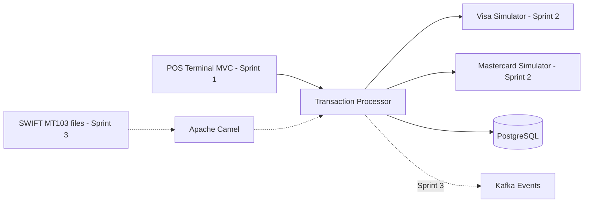

# Financial Integration Platform

A portfolio project that simulates payment processing from a point-of-sale terminal to an acquirer. It is built to demonstrate modern Java, Spring Boot, financial integrations, software quality, and delivery practices.

## Current Implementation

- Java 21 and Spring Boot
- Hexagonal transaction service with domain, application ports, and adapters
- Spring MVC REST API, PostgreSQL/JPA, Lombok, and MapStruct
- JUnit 5, Mockito, and Testcontainers test foundations
- Docker Compose configuration for local PostgreSQL

## Planned Platform

The platform will evolve through four weekly sprints:

1. POS terminal MVC and transaction processing foundations
2. Visa and Mastercard acquirer simulation with simplified ISO 8583 messages
3. Kafka, RabbitMQ, Apache Camel, and SWIFT MT103 import flows
4. CI/CD, Sonar quality gates, integration testing, and portfolio documentation

The detailed backlog and demo outcomes are available in the [delivery roadmap](docs/roadmap.md).

## Architecture Direction



## Local Development

1. Copy `.env.example` to `.env` and adjust local-only values when needed.
2. Start PostgreSQL with `docker compose up -d postgres`.
3. Run the transaction service from `services/transaction-service` with `./mvnw spring-boot:run`.

The default credentials are for local development only. Production credentials must be supplied through environment variables or a secret manager.

## Quality Checks

Run unit and web-layer tests without Docker:

```bash
cd services/transaction-service
./mvnw test
```

Run PostgreSQL integration tests when Docker is available:

```bash
./mvnw verify -Pintegration
```

The JaCoCo HTML report is generated at `services/transaction-service/target/site/jacoco/index.html` after `verify`.
