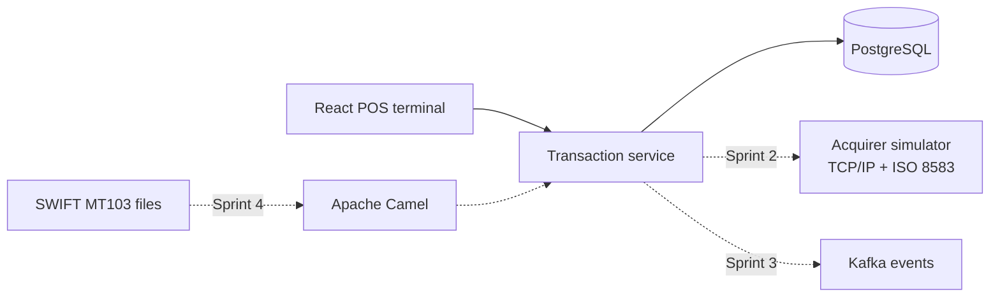

# Financial Integration Platform

A portfolio project that simulates payment processing from a point-of-sale terminal to an acquirer. It demonstrates Java and Spring Boot development, financial integrations, automated testing, and delivery practices through a working application.

## What Works Today

- React and TypeScript payment terminal
- Transaction creation and lookup by UUID
- Java 21 and Spring Boot transaction service
- Hexagonal architecture with ports and adapters
- PostgreSQL persistence and Flyway migrations
- OpenAPI documentation and Swagger UI
- Unit, web, persistence, and integration tests
- Backend and frontend verification with GitHub Actions
- Full local platform with Docker Compose

## Architecture



More detail is available in the [architecture documentation](docs/architecture.md) and [delivery roadmap](docs/roadmap.md).

## Quick Start

This is the simplest way to review the complete application.

### Requirements

- Git
- Docker Desktop
- Ports `5173`, `8080`, and `5432` available

### Run the platform

```bash
git clone https://github.com/LucasBrovetto/financial-integration-platform.git
cd financial-integration-platform
docker compose up --build
```

Wait until the three services report a healthy status, then open:

- POS terminal: `http://localhost:5173`
- Swagger UI: `http://localhost:8080/swagger-ui/index.html`
- API health: `http://localhost:8080/actuator/health`

Stop the platform without deleting local transactions:

```bash
docker compose down
```

Delete the containers and PostgreSQL data when a clean database is required:

```bash
docker compose down --volumes
```

## Local Development

Use this workflow when running the backend from IntelliJ and the frontend from a terminal or VS Code.

### Requirements

- Java 21
- Node.js 24
- pnpm 11.9.0
- Docker Desktop

Copy the optional local configuration file from the repository root:

```bash
cp .env.example .env
```

Start the backend:

```bash
cd services/transaction-service
./mvnw spring-boot:run
```

The default `local` profile uses `docker-compose.dev.yml` to start PostgreSQL automatically. It does not start another backend or frontend container.

In a second terminal, install the frontend dependencies and start Vite:

```bash
cd apps/pos-terminal
pnpm install
pnpm dev
```

Do not run this development workflow and the full Docker Compose stack at the same time because they use the same ports.

When the backend is stopped, its managed PostgreSQL container remains available. Stop it from the repository root with:

```bash
docker compose -f docker-compose.dev.yml stop
```

## Quality Checks

Run backend unit and web tests:

```bash
cd services/transaction-service
./mvnw test
```

Run backend integration tests against PostgreSQL Testcontainers:

```bash
./mvnw verify -Pintegration
```

Run all frontend checks:

```bash
cd apps/pos-terminal
pnpm lint
pnpm test:run
pnpm build
```

## Configuration

- `local` is the default Spring profile and uses the PostgreSQL container started from `docker-compose.dev.yml`.
- `test` is used by Testcontainers and validates Flyway migrations against PostgreSQL.
- `prod` requires `DB_URL`, `DB_USERNAME`, and `DB_PASSWORD`. It validates the schema and disables Swagger endpoints.

Database changes are versioned in `services/transaction-service/src/main/resources/db/migration`.

## API Documentation

With the backend running locally:

- Swagger UI: `http://localhost:8080/swagger-ui/index.html`
- OpenAPI document: `http://localhost:8080/v3/api-docs`

The OpenAPI document is the source of truth for consumers such as `pos-terminal`. The stable Sprint 1 operations are `createTransaction` and `getTransaction`.
