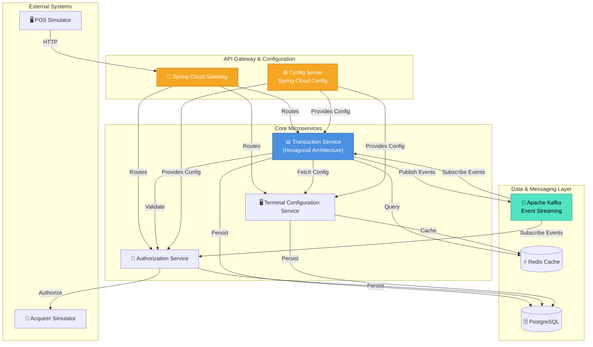

# Microservices Architecture

## Overall System Design

---

## Design Principles

| Principle | Description |
|-----------|-------------|
| **Hexagonal Architecture** | Each microservice isolates domain logic from external dependencies |
| **Spring Cloud Native** | Leverages Spring Cloud Gateway, Config Server, Circuit Breakers |
| **Event-Driven** | Kafka enables asynchronous, decoupled communication |
| **Database per Service** | Each service owns its PostgreSQL schema (logical isolation) |
| **Caching Strategy** | Redis for terminal configs and frequently accessed data |
| **Resilience** | Retry logic, circuit breakers, fallbacks for external calls |

---

## Technology Stack

- **Runtime**: Java 21 + Spring Boot 3.x
- **API Gateway**: Spring Cloud Gateway
- **Configuration**: Spring Cloud Config
- **Messaging**: Apache Kafka
- **Persistence**: PostgreSQL + Hibernate/JPA
- **Caching**: Redis
- **Build**: Maven 3.9+
- **Container**: Docker + Docker Compose
- **Orchestration**: Kubernetes (future)

