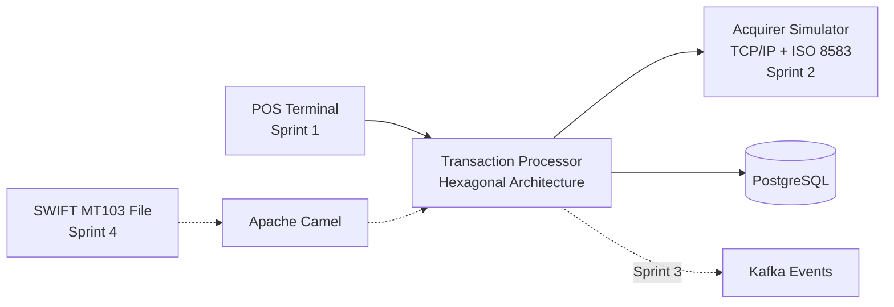

# Platform Architecture

## Portfolio Scope

The platform simulates one clear financial journey: a POS terminal submits a payment, the transaction processor applies business rules, an acquirer returns an authorization decision, and the processor records the outcome.

The repository is delivered incrementally. Components shown as planned are not presented as current implementation.

## Target MVP

## Component Responsibilities

| Component | Responsibility | Delivery |
|---|---|---|
| POS Terminal | React and TypeScript UI that submits a sale and shows its result | Sprint 1 |
| Transaction Processor | Spring Boot API, domain rules, use cases, and persistence ports | Sprint 1 |
| PostgreSQL | Stores transactions and processing status | Sprint 1 |
| Acquirer Simulator | Deterministic authorization responses over TCP/IP using simplified ISO 8583 messages | Sprint 2 |
| Kafka | Publishes transaction lifecycle events through an outbox flow | Sprint 3 |
| Apache Camel | Imports sample SWIFT MT103 files into application commands | Sprint 4 |
| RabbitMQ | Schedules delayed retries for unavailable acquirers | Sprint 3 |

## Design Principles

| Principle | Application in this project |
|---|---|
| Hexagonal architecture | Domain and use cases depend on ports, never on HTTP, JPA, or messaging frameworks. |
| Incremental delivery | A diagram only treats a component as implemented once it has executable code and tests. |
| Financial traceability | Transactions use stable identifiers and record an explicit lifecycle status. |
| Resilience by use case | Timeouts and retries are introduced with the acquirer integration, not as speculative infrastructure. |
| Testability | Domain and application rules are verified independently from adapters. |

## Technology Evidence

- **Sprint 1:** Java 21, Spring Boot, Spring MVC REST, React, TypeScript, PostgreSQL/JPA, Maven, pnpm, Nginx, MapStruct, JUnit 5, Mockito, Testcontainers, GitHub Actions, and Docker Compose.
- **Sprint 2:** Java TCP/IP acquirer, simplified ISO 8583 messages, idempotency, and explicit timeout outcomes.
- **Sprint 3:** PostgreSQL outbox, Kafka events, RabbitMQ recovery jobs, and asynchronous observability.
- **Sprint 4:** Apache Camel, simplified SWIFT MT103 import, validation, and file-processing metrics.
