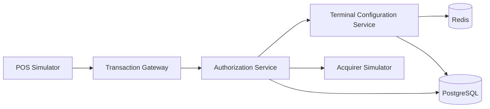

# Architecture

```mermaid
flowchart LR

POS[POS Simulator]

GW[Transaction Gateway]

AUTH[Authorization Service]

CFG[Terminal Configuration Service]

DB[(PostgreSQL)]

CACHE[(Redis)]

ACQ[Acquirer Simulator]

POS --> GW

GW --> AUTH

AUTH --> CFG

CFG --> CACHE

CFG --> DB

AUTH --> ACQ

AUTH --> DB
```
