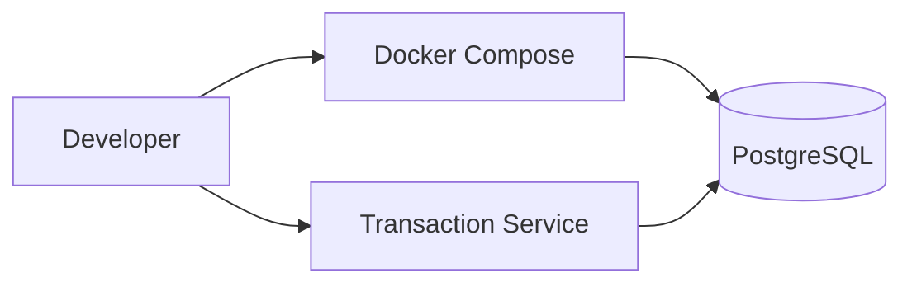

# Deployment Plan

## Local Development Scope

The initial local environment is intentionally small. PostgreSQL is the only runtime dependency required to run the transaction-service foundation. This keeps Sprint 1 reproducible and lets each additional integration prove its value.



## Local Setup

```bash
cp .env.example .env
docker compose up -d postgres
cd services/transaction-service
./mvnw spring-boot:run
```

Environment values are kept in `.env` for local development and are exposed to the application through standard environment variables. `.env` is ignored by Git; `.env.example` documents the required keys.

## Delivery Roadmap

| Sprint | Runtime addition | Reason |
|---|---|---|
| Sprint 1 | POS Terminal and service containers | Demonstrate the core payment flow locally. |
| Sprint 2 | Visa and Mastercard simulators | Demonstrate provider integration and ISO 8583 mapping. |
| Sprint 3 | Kafka, RabbitMQ, and Camel import worker | Demonstrate asynchronous events, retries, and SWIFT import. |
| Sprint 4 | CI pipelines and SonarQube | Demonstrate repeatable quality and delivery controls. |

## Production Direction

Production configuration is outside the MVP. The project will use environment variables or a secret manager for credentials, immutable container images, and CI quality gates before considering Kubernetes deployment.

Kubernetes is deliberately not part of the first portfolio release: a well-tested Compose environment and CI pipeline provide stronger evidence than unused manifests.
