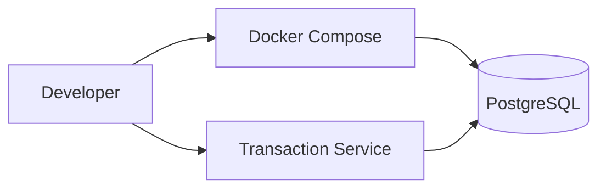

# Deployment Plan

## Local Development Scope

The IDE development environment starts only PostgreSQL as an external dependency. This keeps local work fast while the full Docker Compose setup remains available for end-to-end testing.



## Local Setup

```bash
cp .env.example .env
cd services/transaction-service
./mvnw spring-boot:run
```

Spring Boot starts the PostgreSQL Compose service for the `local` profile and uses `start-only` lifecycle management, so the database remains available after the application stops. The root `.env` file configures Docker Compose and is ignored by Git; `.env.example` documents the available local values.

The local Spring profile uses `docker-compose.dev.yml` so an application started from IntelliJ manages only PostgreSQL. Stop that managed database from the repository root when it is no longer needed:

```bash
docker compose -f docker-compose.dev.yml stop
```

Run the complete local platform as containers from the repository root:

```bash
docker compose up --build
```

Compose waits for PostgreSQL and the transaction service health checks before starting dependent services. The POS terminal is served by Nginx at `http://localhost:5173` and forwards `/api` requests to the transaction service over the internal Compose network. Stop all containers with `docker compose down`.

The automatic Compose startup is the standard development workflow. Exceptionally, if PostgreSQL is already managed elsewhere, start the application with `--spring.docker.compose.enabled=false` and provide `DB_URL`, `DB_USERNAME`, and `DB_PASSWORD` as environment variables. Flyway still applies pending migrations and Hibernate validates the schema. The root `.env` file is not loaded into the Java process automatically.

## Delivery Roadmap

| Sprint | Runtime addition | Reason |
|---|---|---|
| Sprint 1 | POS terminal and transaction-service containers | Demonstrate transaction creation, persistence, and retrieval. |
| Sprint 2 | Java acquirer simulator over TCP/IP | Demonstrate approved, declined, and timeout authorization outcomes. |
| Sprint 3 | Kafka and RabbitMQ | Demonstrate reliable events and controlled recovery jobs. |
| Sprint 4 | Apache Camel file importer | Demonstrate validated and traceable SWIFT MT103 ingestion. |

## Production Direction

Production configuration is outside the MVP. The project will use environment variables or a secret manager for credentials, immutable container images, and CI quality gates before considering Kubernetes deployment.

Kubernetes is deliberately not part of the first portfolio release: a well-tested Compose environment and CI pipeline provide stronger evidence than unused manifests.
