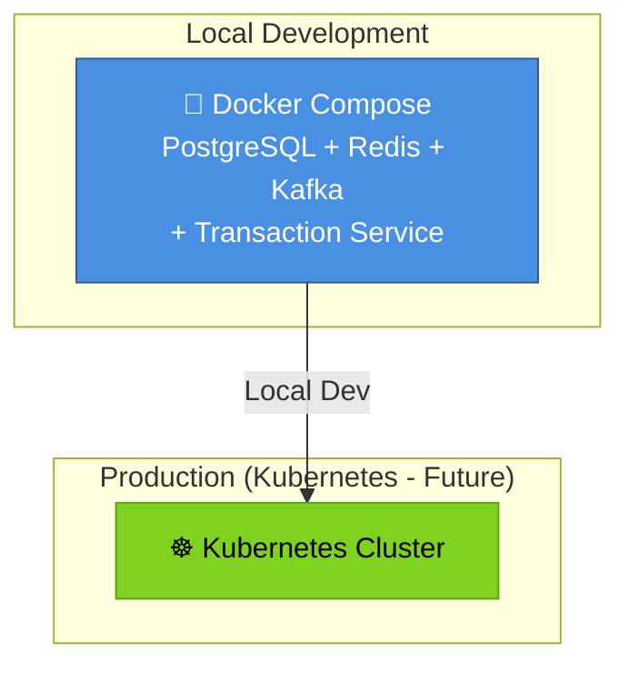

# Deployment Architecture & DevOps

## 1️⃣ Docker Containerization

### Multi-Stage Dockerfile

```dockerfile
# syntax=docker/dockerfile:1

# Stage 1: Build
FROM maven:3.9.4-eclipse-temurin-21 as build

WORKDIR /workspace

COPY pom.xml .
RUN mvn dependency:go-offline -B

COPY src ./src
RUN mvn -B -DskipTests package

# Stage 2: Runtime
FROM eclipse-temurin:21-jre-alpine

ARG JAR_FILE=/workspace/target/*.jar
COPY --from=build ${JAR_FILE} app.jar

HEALTHCHECK --interval=30s --timeout=3s --start-period=40s --retries=3 \
  CMD java -cp app.jar org.springframework.boot.loader.JarLauncher || exit 1

EXPOSE 8080

ENTRYPOINT ["java", "-jar", "/app.jar"]
```

### Docker Compose (Local Development)

```yaml
version: '3.9'

services:
  postgres:
    image: postgres:17-alpine
    container_name: financial-platform-postgres
    environment:
      POSTGRES_DB: financial_platform
      POSTGRES_USER: postgres
      POSTGRES_PASSWORD: postgres_password_dev
    ports:
      - "5432:5432"
    volumes:
      - postgres_data:/var/lib/postgresql/data
    healthcheck:
      test: ["CMD-SHELL", "pg_isready -U postgres"]
      interval: 10s
      timeout: 5s
      retries: 5

  redis:
    image: redis:7-alpine
    container_name: financial-platform-redis
    ports:
      - "6379:6379"
    volumes:
      - redis_data:/data
    healthcheck:
      test: ["CMD", "redis-cli", "ping"]
      interval: 10s
      timeout: 5s
      retries: 5

  kafka:
    image: confluentinc/cp-kafka:7.5.0
    container_name: financial-platform-kafka
    ports:
      - "9092:9092"
    environment:
      KAFKA_BROKER_ID: 1
      KAFKA_ZOOKEEPER_CONNECT: zookeeper:2181
      KAFKA_ADVERTISED_LISTENERS: PLAINTEXT://kafka:29092,PLAINTEXT_HOST://localhost:9092
      KAFKA_LISTENER_SECURITY_PROTOCOL_MAP: PLAINTEXT:PLAINTEXT,PLAINTEXT_HOST:PLAINTEXT
      KAFKA_INTER_BROKER_LISTENER_NAME: PLAINTEXT
      KAFKA_OFFSETS_TOPIC_REPLICATION_FACTOR: 1
    depends_on:
      - zookeeper
    healthcheck:
      test: ["CMD", "kafka-broker-api-versions.sh", "--bootstrap-servers", "localhost:9092"]
      interval: 10s
      timeout: 5s
      retries: 5

  zookeeper:
    image: confluentinc/cp-zookeeper:7.5.0
    container_name: financial-platform-zookeeper
    environment:
      ZOOKEEPER_CLIENT_PORT: 2181
    ports:
      - "2181:2181"

  transaction-service:
    build:
      context: ./services/transaction-service
      dockerfile: Dockerfile
    container_name: transaction-service
    ports:
      - "8080:8080"
    environment:
      SPRING_PROFILES_ACTIVE: docker
      SPRING_DATASOURCE_URL: jdbc:postgresql://postgres:5432/financial_platform
      SPRING_DATASOURCE_USERNAME: postgres
      SPRING_DATASOURCE_PASSWORD: postgres_password_dev
      SPRING_KAFKA_BOOTSTRAP_SERVERS: kafka:29092
      SPRING_REDIS_HOST: redis
      SPRING_REDIS_PORT: 6379
      MANAGEMENT_ENDPOINTS_WEB_EXPOSURE_INCLUDE: health,info,metrics,prometheus
    depends_on:
      postgres:
        condition: service_healthy
      redis:
        condition: service_healthy
      kafka:
        condition: service_healthy
    healthcheck:
      test: ["CMD", "curl", "-f", "http://localhost:8080/actuator/health"]
      interval: 30s
      timeout: 10s
      retries: 3
      start_period: 40s

volumes:
  postgres_data:
  redis_data:

networks:
  default:
    name: financial-platform-network
```

## 2️⃣ Kubernetes Deployment (Future)

Ready for orchestration with Kubernetes and Spring Cloud patterns.

## 3️⃣ CI/CD Pipeline (GitHub Actions - Future)

Ready for automated testing, building, and deployment.

## 4️⃣ Monitoring & Observability (Future)

Prometheus metrics and Grafana dashboards ready.

---

## Deployment Architecture Overview



---

## Quick Start Commands

```bash
# Local Development
docker compose up --build

# Test Locally
curl -X POST http://localhost:8080/transactions \
  -H "Content-Type: application/json" \
  -d '{"terminalId":"POS001","amount":100.00,"type":"SALE"}'

# View Logs
docker compose logs -f transaction-service

# Stop all services
docker compose down
```
