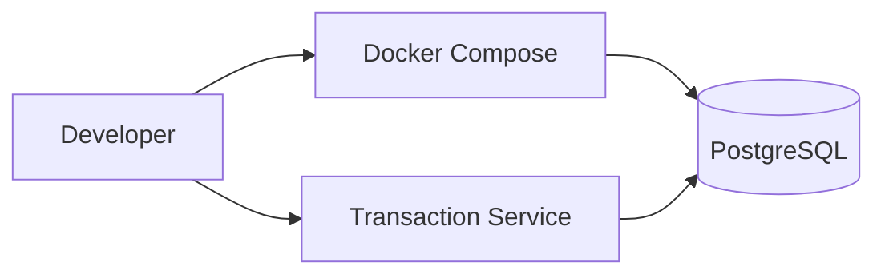

# Deployment Plan

## Local Development Scope

The initial local environment is intentionally small. PostgreSQL is the only runtime dependency required to run the transaction-service foundation. This keeps Sprint 1 reproducible and lets each additional integration prove its value.



## Local Setup

```bash
cp .env.example .env
cd services/transaction-service
./mvnw spring-boot:run
```

Spring Boot starts the PostgreSQL Compose service for the `local` profile and uses `start-only` lifecycle management, so the database remains available after the application stops. The root `.env` file configures Docker Compose and is ignored by Git; `.env.example` documents the available local values.

Stop the managed database from the repository root when it is no longer needed:

```bash
docker compose stop
```

The automatic Compose startup is the standard development workflow. Exceptionally, if PostgreSQL is already managed elsewhere, start the application with `--spring.docker.compose.enabled=false` and provide `DB_URL`, `DB_USERNAME`, and `DB_PASSWORD` as environment variables. Flyway still applies pending migrations and Hibernate validates the schema. The root `.env` file is not loaded into the Java process automatically.

## Delivery Roadmap

| Sprint | Runtime addition | Reason |
|---|---|---|
| Sprint 1 | POS Terminal and service containers | Demonstrate the core payment flow locally. |
| Sprint 2 | Acquirer simulator over TCP/IP | Demonstrate authorization integration and ISO 8583 mapping. |
| Sprint 3 | Kafka, RabbitMQ, and Camel import worker | Demonstrate asynchronous events, retries, and SWIFT import. |
| Sprint 4 | CI pipelines and SonarQube | Demonstrate repeatable quality and delivery controls. |

## Production Direction

Production configuration is outside the MVP. The project will use environment variables or a secret manager for credentials, immutable container images, and CI quality gates before considering Kubernetes deployment.

Kubernetes is deliberately not part of the first portfolio release: a well-tested Compose environment and CI pipeline provide stronger evidence than unused manifests.
