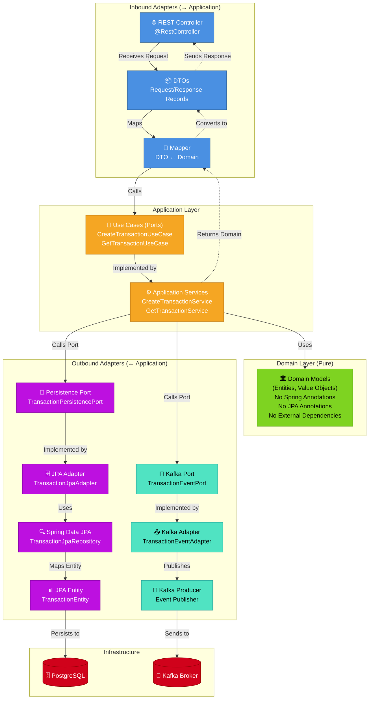
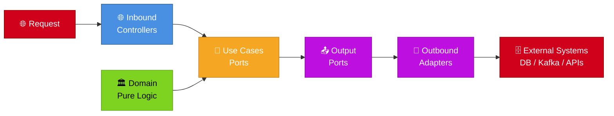
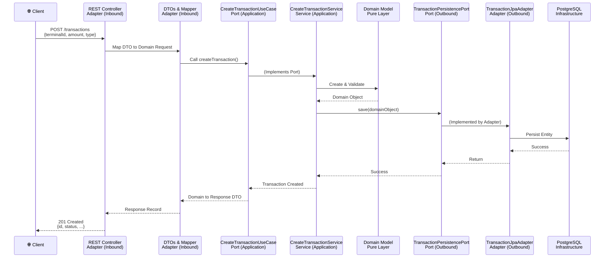

# Hexagonal Architecture (Transaction Service)

## Internal Structure - Ports & Adapters Pattern



---

## Package Structure

```
com.financialintegration.transactionservice
│
├── domain/                              # 🏛️ Pure Domain (no Spring, no JPA)
│   ├── model/                           # Domain entities & value objects
│   └── exception/                       # Domain-specific exceptions
│
├── application/                         # 🎯 Application Layer
│   ├── port/
│   │   ├── in/                          # 📥 Input Ports (Use Cases)
│   │   └── out/                         # 📤 Output Ports
│   └── service/                         # ⚙️ Application Services
│
├── adapters/
│   ├── inbound/                         # 🌐 Inbound Adapters
│   │   ├── web/                         # REST Controller
│   │   └── dto/                         # DTOs & Mappers
│   └── outbound/                        # 💾 Outbound Adapters
│       ├── persistence/                 # JPA Adapter & Repository
│       └── kafka/                       # Kafka Event Publisher
│
├── config/                              # ⚙️ Spring Configuration & Beans
├── exception/                           # 🚨 Global Exception Handler
└── TransactionServiceApplication.java   # 🚀 Bootstrap Class
```

---

## Dependency Flow



---

## Key Principles

| Aspect | Description |
|--------|-------------|
| **Domain Purity** | Domain layer has ZERO external dependencies. No Spring, JPA, Lombok annotations. |
| **Port Abstraction** | Application defines ports (interfaces) for both inbound and outbound. |
| **Adapter Implementation** | External frameworks are kept in adapters (REST, JPA, Kafka). |
| **Dependency Inversion** | Business logic depends on abstractions (ports), not concrete implementations. |
| **Testability** | Domain & application logic tested with mocks; adapters tested separately. |
| **Framework Agnostic** | Domain logic could be reused in different frameworks without changes. |

---

## Example Flow: Create Transaction Request



---

## Testing Strategy

| Layer | Test Type | Tools |
|-------|-----------|-------|
| **Domain** | Unit Tests | JUnit 5 (no mocks needed - pure logic) |
| **Application Services** | Unit Tests | JUnit 5 + Mockito (mock ports) |
| **Inbound Adapters** | Integration Tests | @SpringBootTest + MockMvc |
| **Outbound Adapters** | Integration Tests | Testcontainers (PostgreSQL, Kafka) |
| **End-to-End** | Integration Tests | @SpringBootTest + Testcontainers |

