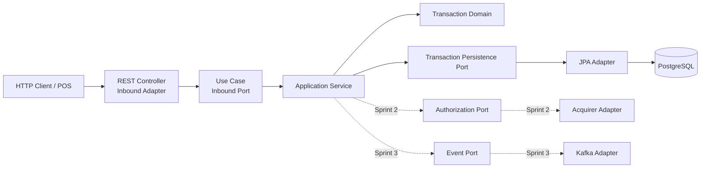
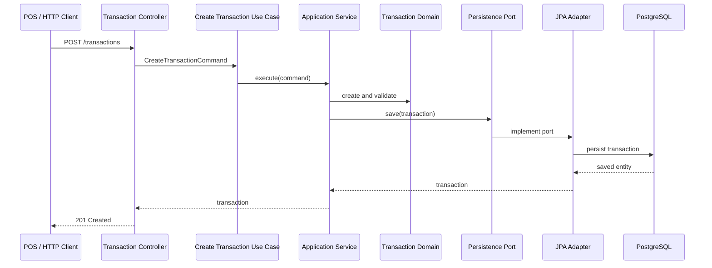

# Hexagonal Architecture

## Transaction Processor

The transaction processor keeps financial rules independent from Spring MVC, JPA, PostgreSQL, and future messaging providers. Inbound adapters call use cases; outbound adapters implement the ports required by those use cases.



## Current Package Structure

```text
com.financialintegration.transactionservice
├── domain/
│   ├── exception/
│   └── model/
├── application/
│   ├── exception/
│   ├── port/
│   │   ├── in/
│   │   └── out/
│   └── service/
├── adapters/
│   ├── inbound/
│   │   ├── dto/
│   │   ├── exception/
│   │   ├── mapper/
│   │   └── web/
│   └── outbound/
│       └── persistence/
└── TransactionServiceApplication.java
```

## Dependency Rules

1. The domain contains financial rules and has no Spring or persistence annotations.
2. The application layer owns use-case interfaces and outgoing ports.
3. Adapters translate between framework-specific models and domain or application models.
4. Future Kafka, ISO 8583, SWIFT, and AI integrations must be introduced as adapters behind explicit ports.

## Example: Create Transaction



## Testing Strategy

| Layer | Test focus | Tools |
|---|---|---|
| Domain | Lifecycle and validation rules | JUnit 5 |
| Application services | Port orchestration and error handling | JUnit 5 + Mockito |
| Web adapter | HTTP validation and error responses | Spring MVC test support |
| Persistence adapter | PostgreSQL mapping | Testcontainers |
