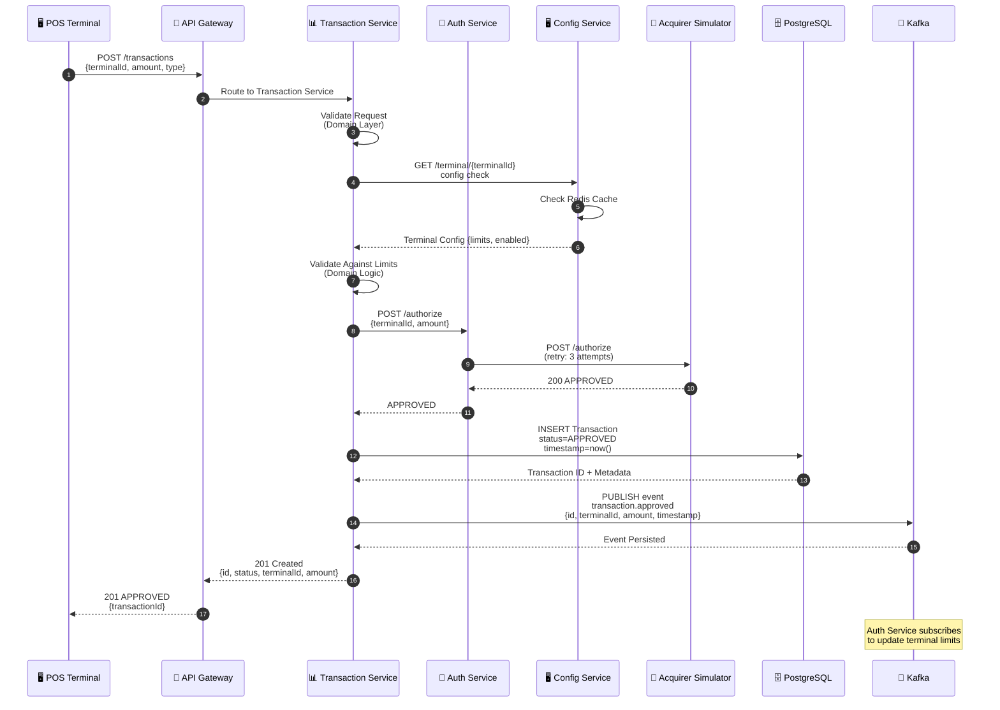
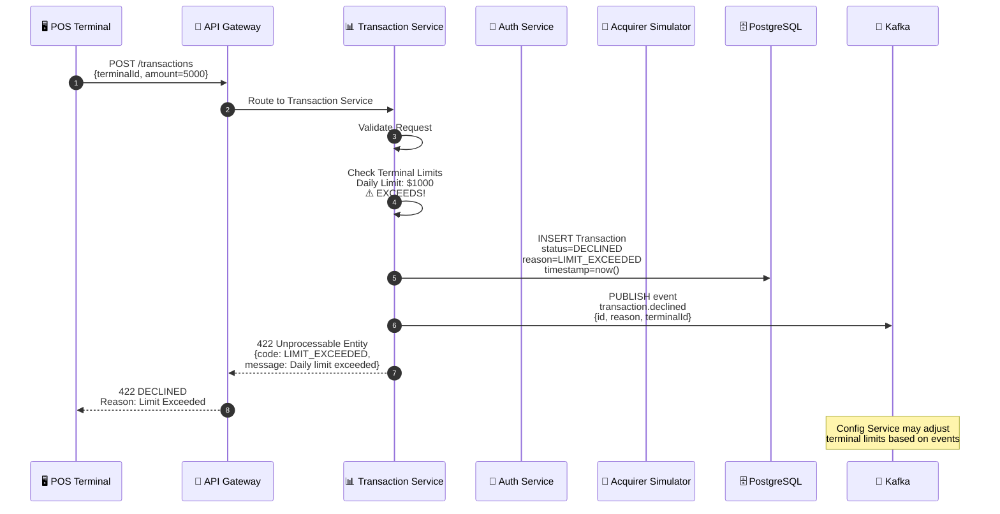
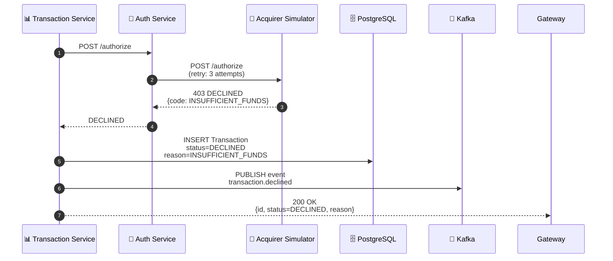
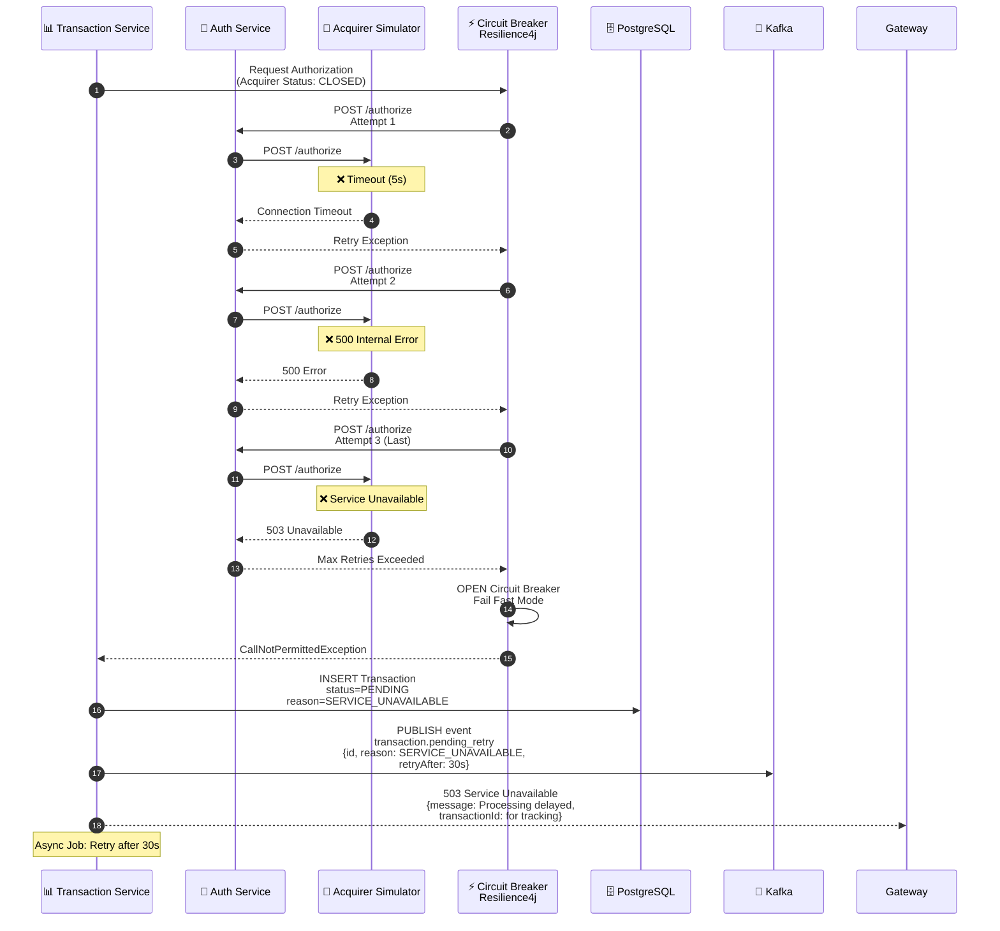
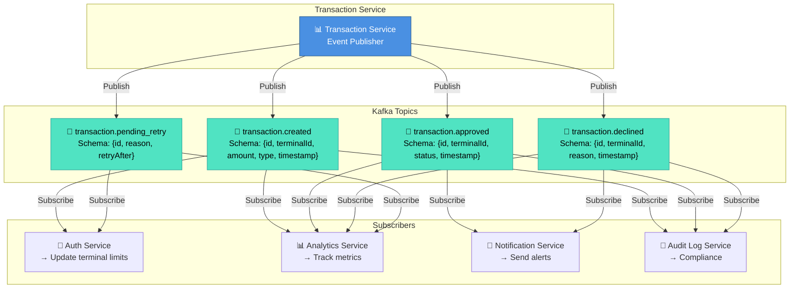
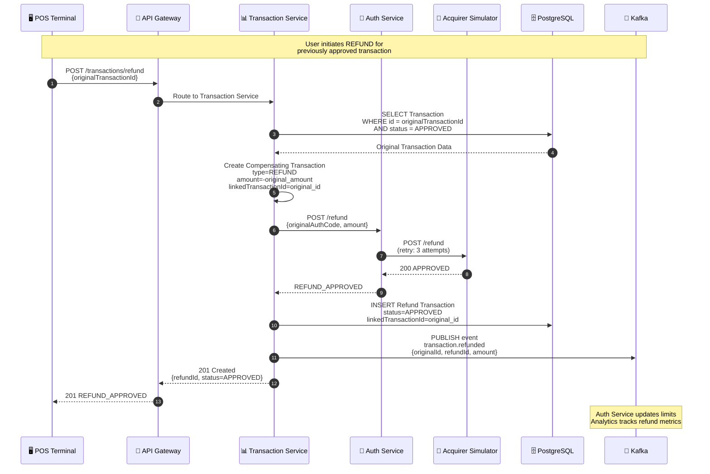
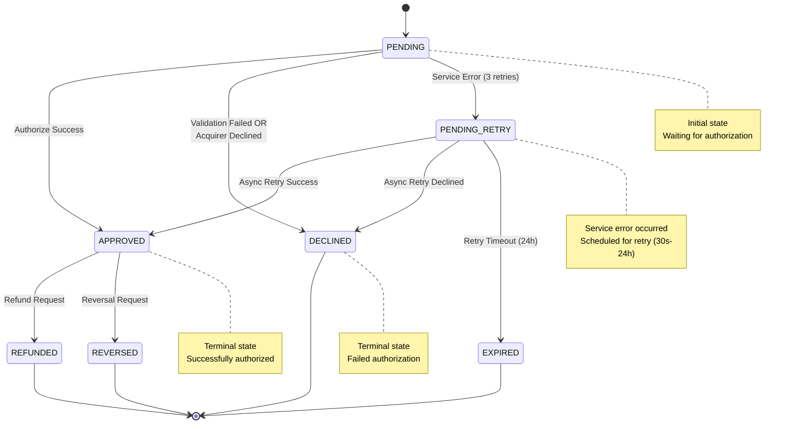

# Transaction Processing Flows

## 1️⃣ Happy Path: Successful Transaction (APPROVED)

---

## 2️⃣ Sad Path: Transaction Declined (DECLINED)

**Alternative Decline Path: Acquirer Rejects**

---

## 3️⃣ Error Path: Retry Logic with Circuit Breaker

---

## 4️⃣ Event-Driven Processing (Kafka Topics)

---

## 5️⃣ Compensating Transaction (Refund/Reversal)

---

## 6️⃣ Transaction Status Timeline

---

## Key Patterns & Resilience Features

| Pattern | Implementation | Benefit |
|---------|----------------|---------|
| **Retry Logic** | Exponential backoff + 3 retries | Handles transient failures |
| **Circuit Breaker** | Resilience4j configuration | Prevents cascading failures |
| **Fallback** | Return PENDING status + async retry | Graceful degradation |
| **Event Sourcing** | Kafka topics persist all events | Audit trail + async processing |
| **Compensation** | Refund/Reversal transactions | Handles business reversals |
| **Idempotency** | Transaction ID as unique key | Safe retries without duplication |
| **Timeout Protection** | Request timeouts (5s) | Prevents hanging requests |

---

## Error Codes & Responses

| Status | Code | Meaning | Retry? |
|--------|------|---------|--------|
| 201 | OK | Transaction approved | ❌ Terminal |
| 422 | LIMIT_EXCEEDED | Daily/terminal limit exceeded | ❌ Terminal |
| 422 | INSUFFICIENT_FUNDS | Acquirer: insufficient funds | ❌ Terminal |
| 422 | INVALID_TERMINAL | Terminal not found/disabled | ❌ Terminal |
| 503 | SERVICE_UNAVAILABLE | Auth/Acquirer unreachable | ✅ Async Retry |
| 500 | PROCESSING_ERROR | Internal server error | ✅ Async Retry |

