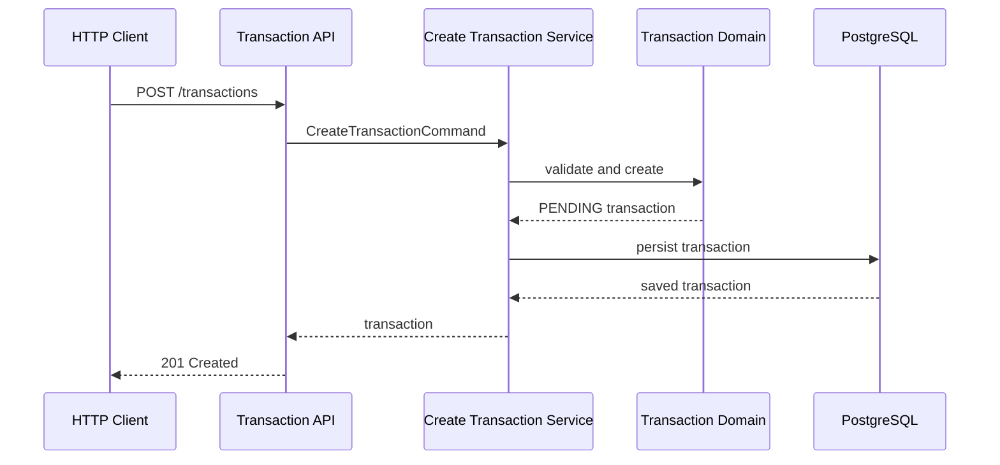
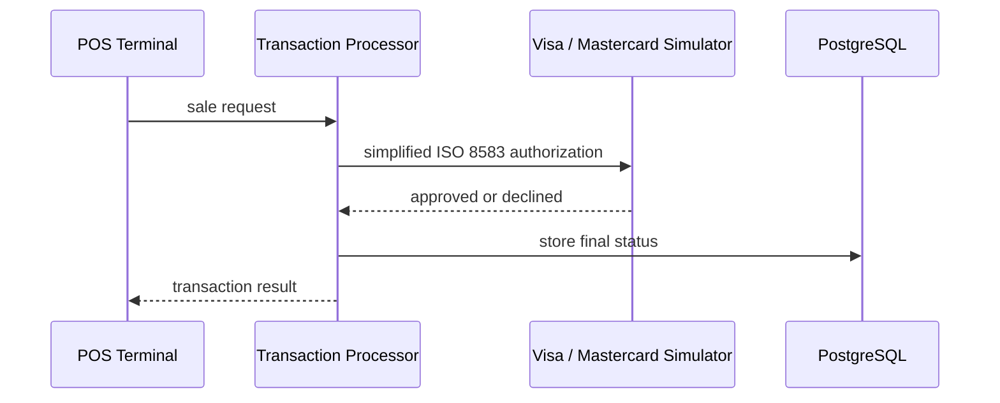
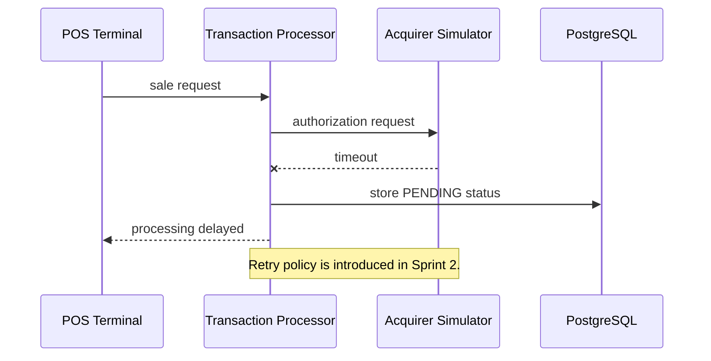

# Transaction Flows

## Current Foundation: Create a Pending Transaction

## Sprint 2: Acquirer Authorization

## Sprint 2: Acquirer Timeout

## Sprint 3: Event Publication

After an outbox record is stored with the transaction, an event publisher sends lifecycle events to Kafka. This is intentionally planned work, not part of the current transaction-service foundation.
